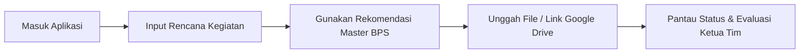

# 📘 BUKU PANDUAN LENGKAP PENGGUNAAN APLIKASI SI-BUDI
**Sistem Evaluasi Kinerja Bulanan & Bukti Dukung Pegawai**  
*Badan Pusat Statistik (BPS) Kabupaten Sigi*

---

## 📑 DAFTAR ISI

- [BAGIAN I: PENDAHULUAN & INFORMASI UMUM](#bagian-i-pendahuluan--informasi-umum)
  - [1.1 Latar Belakang & Tujuan](#11-latar-belakang--tujuan)
  - [1.2 Struktur Peran Pengguna (Role Matrix)](#12-struktur-peran-pengguna-role-matrix)
  - [1.3 Ketentuan Kepatuhan & Pemotongan Tukin (H+5)](#13-ketentuan-kepatuhan--pemotongan-tukin-h5)
  - [1.4 Navigasi Antarmuka (Desktop, Mobile Drawer, & Theme)](#14-navigasi-antarmuka-desktop-mobile-drawer--theme)
- [BAGIAN II: PANDUAN PERAN PEGAWAI (ANGGOTA TIM)](#bagian-ii-panduan-peran-pegawai-anggota-tim)
  - [2.1 Alur Kerja Pegawai](#21-alur-kerja-pegawai)
  - [2.2 Menginput Rencana Kinerja Bulanan (SKP Utama & Tambahan)](#22-menginput-rencana-kinerja-bulanan-skp-utama--tambahan)
  - [2.3 Menggunakan Rekomendasi Kegiatan Master BPS (Auto-Fill & Auto-Save)](#23-menggunakan-rekomendasi-kegiatan-master-bps-auto-fill--auto-save)
  - [2.4 Mengunggah & Mengaitkan Bukti Dukung (File / Google Drive)](#24-mengunggah--mengaitkan-bukti-dukung-file--google-drive)
  - [2.5 Pemantauan Kalender & Status Kegiatan](#25-pemantauan-kalender--status-kegiatan)
- [BAGIAN III: PANDUAN PERAN KETUA TIM (EVALUATOR)](#bagian-iii-panduan-peran-ketua-tim-evaluator)
  - [3.1 Alur Kerja Ketua Tim](#31-alur-kerja-ketua-tim)
  - [3.2 Pemantauan Dasbor Progres Kinerja Tim](#32-pemantauan-dasbor-progres-kinerja-tim)
  - [3.3 Pemeriksaan & Verifikasi Bukti Dukung Document/Drive](#33-pemeriksaan--verifikasi-bukti-dukung-documentdrive)
  - [3.4 Pemberian Penilaian (0-100) & Umpan Balik (Feedback)](#34-pemberian-penilaian-0-100--umpan-balik-feedback)
  - [3.5 Pengawasan Kepatuhan & Ekspor Rekap Excel Tim](#35-pengawasan-kepatuhan--ekspor-rekap-excel-tim)
- [BAGIAN IV: PANDUAN PERAN PIMPINAN (KEPALA BPS)](#bagian-iv-panduan-peran-pimpinan-kepala-bps)
  - [4.1 Alur Kerja Pimpinan](#41-alur-kerja-pimpinan)
  - [4.2 Monitoring Dasbor Eksekutif Real-Time Satker](#42-monitoring-dasbor-eksekutif-real-time-satker)
  - [4.3 Pengawasan Kedisiplinan & Tabel Simulasi Pemotongan Tukin (H+5)](#43-pengawasan-kedisiplinan--tabel-simulasi-pemotongan-tukin-h5)
  - [4.4 Ekspor Laporan Kinerja Satker ke Excel (.xlsx)](#44-ekspor-laporan-kinerja-satker-ke-excel-xlsx)
- [BAGIAN V: PANDUAN PERAN ADMINISTRATOR (ADMIN)](#bagian-v-panduan-peran-administrator-admin)
  - [5.1 Alur Kerja Administrator](#51-alur-kerja-administrator)
  - [5.2 Pemantauan Jejak Audit Sistem (Audit Log)](#52-pemantauan-jejak-audit-sistem-audit-log)
  - [5.3 Pengelolaan Akun Pengguna & Peran (Role Management)](#53-pengelolaan-akun-pengguna--peran-role-management)
  - [5.4 Pemeliharaan Master Rekomendasi Kegiatan BPS & Database](#54-pemeliharaan-master-rekomendasi-kegiatan-bps--database)
- [BAGIAN VI: PERTANYAAN UMUM (FAQ) & TROUBLESHOOTING](#bagian-vi-pertanyaan-umum-faq--troubleshooting)

---

## BAGIAN I: PENDAHULUAN & INFORMASI UMUM

### 1.1 Latar Belakang & Tujuan
Aplikasi **SI-BUDI** (Sistem Evaluasi Kinerja Bulanan & Bukti Dukung) dirancang untuk memodernisasi dan menstandarisasi pelaporan kinerja bulanan pegawai BPS Kabupaten Sigi. Aplikasi ini memastikan uraian kegiatan seragam, pengumpulan bukti dukung tertib, serta penilaian kinerja obyektif.

### 1.2 Struktur Peran Pengguna (Role Matrix)

| Peran Pengguna | Ikon | Deskripsi Singkat & Ringkasan Tanggung Jawab |
| :--- | :---: | :--- |
| **Pegawai (Anggota)** | 🧑‍💼 | Menginput rencana SKP, memilih rekomendasi kegiatan acuan BPS, mengunggah bukti dukung (File/Drive), memantau status evaluasi. |
| **Ketua Tim** | 👔 | Memantau kinerja anggota tim, memeriksa & memverifikasi dokumen bukti dukung, memberikan penilaian (0-100) dan umpan balik (*feedback*). |
| **Pimpinan (Kepala BPS)** | 🏛️ | Memantau dasbor eksekutif seluruh instansi, mengawasi ketepatan waktu & simulasi potongan Tukin (H+5), serta mendownload laporan Excel. |
| **Administrator** | ⚙️ | Memantau Jejak Audit (*Audit Log*), mengelola akun & peranan (*Role*), serta memelihara database master rekomendasi kegiatan BPS. |

### 1.3 Ketentuan Kepatuhan & Pemotongan Tukin (H+5)
- ⚠️ **Peringatan H+3**: Kegiatan yang dibuat dan belum dilengkapi bukti dukung selama ≥ 3 hari akan memicu notifikasi peringatan.
- 🔴 **Ketentuan H+5 & Simulasi Tukin**: Kegiatan yang belum diselesaikan/dinilai setelah melewati H+5 bulan berjalan dianggap *Overdue*, dan disimulasikan berdampak pada pemotongan Tunjangan Kinerja (Tukin) sebesar **0.05% per kegiatan keterlambatan**.

### 1.4 Navigasi Antarmuka (Desktop, Mobile Drawer, & Theme)
- **Desktop Sidebar**:
  - Terdapat tombol toggle **`<<` / `>>`** di bawah logo SI-BUDI untuk melipat (*collapse*) atau memperlebar sidebar.
  - Di mode *collapse*, ikon keluar (logout) berpindah ke atas avatar profil.
- **Mobile Drawer (Smartphone/Tablet)**:
  - Pada layar kecil, sidebar otomatis tersembunyi (*off-canvas*).
  - Klik tombol **Menu Hamburger (☰)** di header atas untuk membuka drawer.
  - Klik ikon silang **(✕)** atau area luar redup untuk menutup drawer.
- **Ubah Mode Gelap/Terang (Theme)**: Klik ikon **🌙/☀️** pada header bagian kanan atas.
- **Profil & Ubah Password**: Klik avatar profil di kanan atas header atau bawah sidebar untuk membuka modal ubah kata sandi.

---

## BAGIAN II: PANDUAN PERAN PEGAWAI (ANGGOTA TIM)

### 2.1 Alur Kerja Pegawai

### 2.2 Menginput Rencana Kinerja Bulanan (SKP Utama & Tambahan)
1. Buka tab **Rencana Kinerja & Bukti**.
2. Klik tombol **+ Tambah Kegiatan Baru**.
3. Pilih Jenis Rencana Kinerja:
   - **SKP Utama**: Kegiatan yang terkait langsung dengan rencana kinerja SKP induk.
   - **Kegiatan Tambahan**: Tugas penugasan tambahan di luar SKP utama.
4. Isi **Nama Kegiatan**, **Target Volume**, **Satuan**, **Output Rincian**, serta **Tanggal Mulai** dan **Tanggal Selesai**.
5. Klik **Simpan Kegiatan**.

### 2.3 Menggunakan Rekomendasi Kegiatan Master BPS (Auto-Fill & Auto-Save)
1. Pada form *Tambah Kegiatan*, perhatikan bagian **Rekomendasi Kegiatan Master BPS**.
2. Gunakan **Filter Bidang** (*Sosial, Produksi, Distribusi, Nerwilis, IPDS, Umum*) atau kolom pencarian kata kunci.
3. Pilih salah satu rekomendasi acuan BPS (diperkaya badge `🔥 Xx dipakai`).
4. Klik **Gunakan Rekomendasi** — Kolom Uraian Kegiatan, Satuan, dan Output Rincian akan terisi secara otomatis (*Auto-fill*).
5. *Auto-Save*: Setiap kegiatan baru yang Anda input secara manual akan otomatis tersimpan ke database rekomendasi untuk digunakan kembali di kemudian hari.

### 2.4 Mengunggah & Mengaitkan Bukti Dukung (File / Google Drive)
1. Pada daftar kegiatan Anda, temukan kegiatan yang berstatus `MENUNGGU_BUKTI`.
2. Klik tombol **+ Upload / Tautkan Bukti Dukung**.
3. Pilih metode:
   - 📄 **Upload File**: Unggah berkas dokumen PDF/Gambar dari HP atau Komputer.
   - 🔗 **Tautan Google Drive**: Tempelkan URL berkas Google Drive bukti dukung. Pastikan akses tautan Drive sudah dibuka untuk publik/internal.
4. Beri nama keterangan bukti dukung, lalu klik **Simpan Bukti**. Status kegiatan berubah menjadi `LENGKAP`.

### 2.5 Pemantauan Kalender & Status Kegiatan
- Buka tab **Kalender Kegiatan** untuk melihat jadwal sebaran tugas bulanan.
- Klik pada tanggal tertentu untuk melihat rincian kegiatan yang berlangsung pada hari tersebut.

---

## BAGIAN III: PANDUAN PERAN KETUA TIM (EVALUATOR)

### 3.1 Alur Kerja Ketua Tim

### 3.2 Pemantauan Dasbor Progres Kinerja Tim
1. Masuk menggunakan akun Ketua Tim.
2. Pada tab **Dasbor Utama (Summary)**, tinjau rekapitulasi tim:
   - **Total Kegiatan Tim** & **Persentase Penyelesaian**.
   - **Rata-Rata Nilai Kinerja Anggota Tim**.
   - **Daftar Keterlambatan Tim** (kegiatan anggota yang mendekati/melewati H+5).

### 3.3 Pemeriksaan & Verifikasi Bukti Dukung Document/Drive
1. Buka tab **Rencana Kinerja & Bukti**.
2. Filter daftar berdasarkan nama anggota tim Anda.
3. Pada kegiatan berstatus `LENGKAP`, klik nama berkas atau **Tautan Google Drive** untuk memeriksa bukti dokumen.
4. Klik tombol **Verifikasi Bukti**. Jika dokumen sesuai, label berubah menjadi `LENGKAP & RELEVAN`.

### 3.4 Pemberian Penilaian (0-100) & Umpan Balik (Feedback)
1. Klik tombol **Beri Penilaian** pada kegiatan yang telah terverifikasi.
2. Masukkan **Nilai Kinerja** (skala 0 - 100).
3. Masukkan **Umpan Balik / Catatan Evaluasi** (misal: *"Hasil cacah lapangan sangat lengkap, rapi, dan tepat waktu"*).
4. Klik **Simpan Penilaian**. Status kegiatan otomatis berubah menjadi **DINILAI**.

### 3.5 Pengawasan Kepatuhan & Ekspor Rekap Excel Tim
- Pantau tabel **Simulasi Pemotongan Tukin** untuk mengingatkan anggota tim yang memiliki tugas *Overdue*.
- Klik tombol **📥 Ekspor Laporan Excel** untuk mengunduh rekap kinerja tim lengkap dengan link bukti dukung.

---

## BAGIAN IV: PANDUAN PERAN PIMPINAN (KEPALA BPS)

### 4.1 Alur Kerja Pimpinan

### 4.2 Monitoring Dasbor Eksekutif Real-Time Satker
1. Masuk ke aplikasi dengan akun Pimpinan / Kepala BPS.
2. Pada **Dasbor Utama (Summary)**, monitor statistik seluruh unit BPS Kab. Sigi:
   - **Total Kegiatan Instansi** & **Tingkat Capaian Penyelesaian**.
   - **Rata-Rata Nilai Kinerja Satker**.
   - **Daftar Kegiatan Tertunda Satker**.

### 4.3 Pengawasan Kedisiplinan & Tabel Simulasi Pemotongan Tukin (H+5)
1. Tinjau panel **Simulasi Pemotongan Tunjangan Kinerja (Tukin)**.
2. Sistem menampilkan daftar pegawai yang memiliki kegiatan *Overdue* (lewat H+5) beserta perkiraan pemotongan Tukin (0.05% per kegiatan).
3. Informasi ini menjadi acuan objektif Pimpinan dalam pembinaan disiplin dan evaluasi instansi.

### 4.4 Ekspor Laporan Kinerja Satker ke Excel (.xlsx)
1. Klik tombol **📥 Ekspor Laporan Excel**.
2. Berkas Excel `.xlsx` yang terunduh berisi data lengkap seluruh pegawai, status verifikasi, nilai evaluasi, dan tautan dokumen bukti dukung yang siap dilaporkan ke BPS Provinsi / Pusat.

---

## BAGIAN V: PANDUAN PERAN ADMINISTRATOR (ADMIN)

### 5.1 Alur Kerja Administrator

### 5.2 Pemantauan Jejak Audit Sistem (Audit Log)
1. Buka tab **Audit Log Sistem**.
2. Tinjau riwayat transaksi sistem (Waktu, Nama/NIP User, Tipe Aksi, Alamat IP, dan Keterangan).
3. Gunakan log ini untuk kebutuhan pemeriksaan keamanan dan audit data.

### 5.3 Pengelolaan Akun Pengguna & Peran (Role Management)
1. Admin berwenang mengelola data pegawai dan peranan (*Role*): `anggota`, `ketua_tim`, `kepala` (Pimpinan), atau `admin`.
2. Admin berhak melakukan reset password bagi pegawai yang mengalami kendala akses.

### 5.4 Pemeliharaan Master Rekomendasi Kegiatan BPS & Database
1. Admin memantau frekuensi penggunaan 370+ data master rekomendasi acuan BPS (`usageCount`).
2. Admin berhak merapikan entri rekomendasi agar terstandarisasi.
3. Memastikan koneksi database Supabase PostgreSQL berjalan aman dan responsif.

---

## BAGIAN VI: PERTANYAAN UMUM (FAQ) & TROUBLESHOOTING

**Q1: Bagaimana jika saya lupa password akun SI-BUDI saya?**  
*Jawab*: Anda dapat menghubungi Administrator sistem BPS Kab. Sigi untuk melakukan reset password akun Anda.

**Q2: Mengapa muncul pesan error saat mengunggah bukti dukung Google Drive?**  
*Jawab*: Pastikan izin akses link Google Drive Anda diatur ke *"Siapa saja yang memiliki link dapat melihat"* (*Anyone with the link can view*).

**Q3: Apakah rekomendasi kegiatan yang baru dimasukkan akan tersimpan untuk pegawai lain?**  
*Jawab*: Ya, sistem SI-BUDI secara otomatis menyimpan uraian kegiatan dan satuan baru ke database rekomendasi sehingga bisa langsung digunakan oleh seluruh pegawai lain.

---
*Buku Panduan Lengkap SI-BUDI BPS Kabupaten Sigi — Versi 1.0 (2026)*
